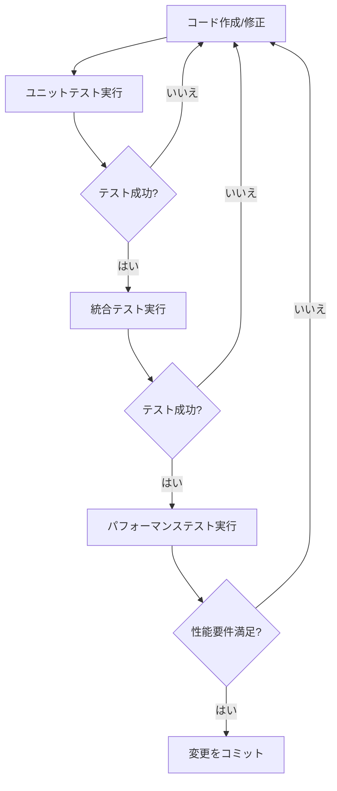

# テスト実行ガイド

## 概要

このガイドでは、orion2GeoJSON Kongプラグインのテスト実行に関する詳細な手順を説明します。ユニットテスト、統合テスト、パフォーマンステストのすべてをカバーします。

## 前提条件

テスト実行前に以下を確認してください：
1. テスト環境が適切にセットアップされていること（[setup.md](../setup.md)参照）
2. 必要なサービスがすべて起動していること
3. テストデータが準備されていること

## テストの種類と実行コマンド

### 1. ユニットテスト

#### 基本的なユニットテスト実行
```bash
# 全ユニットテストの実行
pongo run spec/plugin-orionGeoJSON/01-unit_spec.lua

# 詳細出力付きで実行
pongo run --verbose spec/plugin-orionGeoJSON/01-unit_spec.lua
```

#### カバレッジ分析
```bash
# カバレッジ付きでテスト実行
pongo run --coverage spec/plugin-orionGeoJSON/01-unit_spec.lua

# カバレッジレポートの確認
luacov && cat luacov.report.out
```

### 2. 統合テスト

#### 環境準備
```bash
# テスト環境の起動
pongo up

# サービスの起動確認
curl localhost:1026/version  # Orionの確認
curl localhost:8001/status   # Kongの確認
```

#### テスト実行
```bash
# 統合テストの実行
pongo run spec/plugin-orionGeoJSON/02-integration_spec.lua

# 特定のテストファイルの実行
pongo run spec/plugin-orionGeoJSON/02-integration_spec.lua:123  # 行番号指定
```

### 3. パフォーマンステスト

#### 環境セットアップ
```bash
# クリーンな状態の確保
pongo down && pongo up

# システムのウォームアップ
./scripts/warmup.sh
```

#### テスト実行
```bash
# パフォーマンステストの実行
pongo run spec/plugin-orionGeoJSON/03-performance_spec.lua

# メトリクス収集付きで実行
pongo run --perf-output=perf.json spec/plugin-orionGeoJSON/03-performance_spec.lua
```

## テストワークフロー

### 1. 開発ワークフロー



### 2. 継続的インテグレーションワークフロー

1. プレコミットチェック：
```bash
# リンターの実行
pongo lint

# ユニットテストの実行
pongo run spec/plugin-orionGeoJSON/01-unit_spec.lua
```

2. CIパイプラインテスト：
```bash
# 完全なテストスイート実行
pongo run
```

## テスト結果の分析

### 1. ユニットテスト結果

出力例：
```
TAP version 13
# プラグインスキーマバリデーション
ok 1 - 必須フィールドの検証
ok 2 - フィールド形式の検証
# データ変換
ok 3 - 単一エンティティの変換
ok 4 - 複数エンティティの変換
...
```

### 2. 統合テスト結果

出力例：
```
# orion2GeoJSON統合テスト
ok 1 - 単一エンティティの取得
ok 2 - GeoJSONへの変換
ok 3 - エラー処理の正常動作
...
```

### 3. パフォーマンステスト結果

メトリクス例：
```json
{
  "response_times": {
    "avg": 45.2,
    "p95": 95.1,
    "max": 150.3
  },
  "memory_usage": {
    "start": 1024,
    "end": 1124,
    "peak": 1200
  }
}
```

## トラブルシューティング

### 1. よくある問題

#### テスト失敗時
1. テストログの確認：
```bash
pongo run --verbose [テストファイル]
```

2. 環境の確認：
```bash
pongo info
```

#### パフォーマンス問題
1. システムリソースの確認：
```bash
# メモリ使用量
free -h

# CPU使用率
top
```

2. Kongログの監視：
```bash
pongo logs
```

### 2. デバッグモード

デバッグモードでのテスト実行：
```bash
# デバッグ出力の有効化
export KONG_LOG_LEVEL=debug

# 詳細出力付きでテスト実行
pongo run --verbose [テストファイル]
```

## CI/CD統合

### 1. GitHub Actions

`.github/workflows/test.yml`：
```yaml
name: テスト
on: [push, pull_request]

jobs:
  test:
    runs-on: ubuntu-latest
    steps:
      - uses: actions/checkout@v2
      - name: テスト環境セットアップ
        run: |
          curl -Ls https://get.konghq.com/pongo | bash
          export PATH=$PATH:~/.local/bin
      - name: テスト実行
        run: |
          pongo run
```

### 2. ローカルCI実行シミュレーション
```bash
# CI完全パイプラインのシミュレーション
./scripts/ci_test.sh
```

## ベストプラクティス

1. テストの実行順序：
   - 最初にユニットテスト
   - 次に統合テスト
   - 最後にパフォーマンステスト

2. 定期的なテスト：
   ```bash
   # 朝一の確認
   git pull
   pongo run
   ```

3. コミット前：
   ```bash
   # プレコミットチェック
   ./scripts/pre-commit.sh
   ```

## 追加リソース

- [テストケースドキュメント](../test_cases/)
- [トラブルシューティングガイド](troubleshooting.md)
- [Kongテストフレームワークドキュメント](https://docs.konghq.com/gateway/latest/reference/test-framework/)