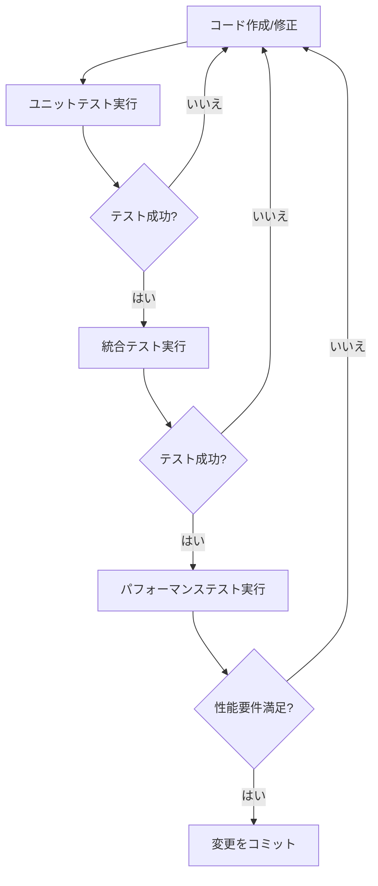

# テスト実行ガイド

## 概要

このガイドでは、orion2GeoJSON Kongプラグインのテスト実行に関する詳細な手順を説明します。ユニットテスト、統合テスト、パフォーマンステストのすべてをカバーします。

## 前提条件

テスト実行前に以下を確認してください：
1. テスト環境が適切にセットアップされていること（[setup.md](../setup.md)参照）
2. 必要なサービスがすべて起動していること
3. テストデータが準備されていること

## テストの種類と実行コマンド

### 1. ユニットテスト

#### 基本的なユニットテスト実行
```bash
# 全ユニットテストの実行
pongo run spec/plugin-orionGeoJSON/01-unit_spec.lua

# 詳細出力付きで実行
pongo run --verbose spec/plugin-orionGeoJSON/01-unit_spec.lua
```

#### カバレッジ分析
```bash
# カバレッジ付きでテスト実行
pongo run --coverage spec/plugin-orionGeoJSON/01-unit_spec.lua

# カバレッジレポートの確認
luacov && cat luacov.report.out
```

### 2. 統合テスト

#### 環境準備
```bash
# テスト環境の起動
pongo up

# サービスの起動確認
curl localhost:1026/version  # Orionの確認
curl localhost:8001/status   # Kongの確認
```

#### テスト実行
```bash
# 統合テストの実行
pongo run spec/plugin-orionGeoJSON/02-integration_spec.lua

# 特定のテストファイルの実行
pongo run spec/plugin-orionGeoJSON/02-integration_spec.lua:123  # 行番号指定
```

### 3. パフォーマンステスト

#### 環境セットアップ
```bash
# クリーンな状態の確保
pongo down && pongo up

# システムのウォームアップ
./scripts/warmup.sh
```

#### テスト実行
```bash
# パフォーマンステストの実行
pongo run spec/plugin-orionGeoJSON/03-performance_spec.lua

# メトリクス収集付きで実行
pongo run --perf-output=perf.json spec/plugin-orionGeoJSON/03-performance_spec.lua
```

### 4. 手動テスト実行

手動テストでは、実際のKong環境でプラグインの動作を確認します。データベース付きのKongを起動し、手動でサービスとルートを設定して、エンドツーエンドのテストを行います。

#### 手動テスト環境のセットアップ

1. データベース付きKongの起動：
```bash
# PostgreSQLとKongを起動（データベースモード）
pongo run migrations up  # データベースマイグレーション
KONG_DATABASE=postgres pongo up  # DBモードでKong起動

# Kongの状態確認
curl -i http://localhost:8001
```

2. プラグインのインストール：
```bash
# プラグインのビルドとインストール
pongo shell
```
```bash
# 以後、Pongo shell内で実行する
# Kongをデータベース付きで起動する
kms
```

```bash
# プラグインが正しくロードされているか確認
curl -s http://localhost:8001/plugins/enabled | jq | grep orion2GeoJSON
```

#### サービスとルートの設定

1. Orionサービスの登録：
```bash
# Orionサービスの作成
curl -i -X POST http://localhost:8001/services \
  --data name=orion \
  --data url=http://orion:1026

# Orionサービスにルートを追加
curl -i -X POST http://localhost:8001/services/orion/routes \
  --data paths[]=/orion \
  --data strip_path=true

# サービスとルートの確認
curl -s http://localhost:8001/services/orion | jq
curl -s http://localhost:8001/services/orion/routes | jq
```

2. プラグインの有効化：
```bash
# サービスにプラグインを適用
curl -i -X POST http://localhost:8001/services/orion/plugins \
  --data name=orion2GeoJSON \
  --data config.entity_type=Room \
  --data config.location_attr=location

# プラグインの設定を確認
curl -s http://localhost:8001/services/orion/plugins | jq
```

#### テストデータの作成と検証

1. 正常系のテストエンティティ作成：
```bash
# Room1: 基本的なケース
curl -i -X POST http://localhost:8000/orion/v2/entities \
  -H 'Content-Type: application/json' \
  -d '{
    "id": "Room1",
    "type": "Room",
    "temperature": {
      "value": 23,
      "type": "Float"
    },
    "location": {
      "value": {
        "type": "Point",
        "coordinates": [13.3986112, 52.554699]
      },
      "type": "geo:json"
    }
  }'

# Room2: 異なる座標と温度
curl -i -X POST http://localhost:8000/orion/v2/entities \
  -H 'Content-Type: application/json' \
  -d '{
    "id": "Room2",
    "type": "Room",
    "temperature": {
      "value": 25,
      "type": "Float"
    },
    "location": {
      "value": {
        "type": "Point",
        "coordinates": [13.3987000, 52.554800]
      },
      "type": "geo:json"
    }
  }'

# Room3: さらに異なる座標と温度
curl -i -X POST http://localhost:8000/orion/v2/entities \
  -H 'Content-Type: application/json' \
  -d '{
    "id": "Room3",
    "type": "Room",
    "temperature": {
      "value": 21,
      "type": "Float"
    },
    "location": {
      "value": {
        "type": "Point",
        "coordinates": [13.3985000, 52.554600]
      },
      "type": "geo:json"
    }
  }'
```

2. エラーケース用のテストエンティティ作成：
```bash
# 異なるタイプのエンティティ
curl -i -X POST http://localhost:8000/orion/v2/entities \
  -H 'Content-Type: application/json' \
  -d '{
    "id": "Sensor1",
    "type": "Sensor",
    "location": {
      "value": {
        "type": "Point",
        "coordinates": [13.3986, 52.5547]
      },
      "type": "geo:json"
    }
  }'

# 位置情報なしのエンティティ
curl -i -X POST http://localhost:8000/orion/v2/entities \
  -H 'Content-Type: application/json' \
  -d '{
    "id": "RoomNoLocation",
    "type": "Room",
    "temperature": {
      "value": 25,
      "type": "Float"
    }
  }'
```

3. 作成したエンティティの確認：
```bash
# 全エンティティの一覧を取得（Orion形式）
echo "=== Orion形式での全エンティティ一覧 ==="
curl -s http://localhost:8000/orion/v2/entities | jq

# Room型エンティティの一覧をOrion形式で確認
echo "=== Orion形式でのRoom型エンティティ一覧 ==="
curl -s http://localhost:8000/orion/v2/entities?type=Room | jq

# GeoJSON形式での取得（format=geojsonを使用）
echo "=== GeoJSON形式でのRoom型エンティティ一覧（クエリパラメータ使用） ==="
curl -s 'http://localhost:8000/orion/v2/entities?type=Room&format=geojson' | jq
```

4. プラグインの動作確認：
```bash
# 条件付き変換の無効化をテスト
echo "=== conditional_transform=falseの場合（常に変換） ==="
curl -i -X PATCH http://localhost:8001/services/orion/plugins/{plugin_id} \
  --data config.conditional_transform=false

# 通常のリクエストでもGeoJSON形式で取得できることを確認
echo "=== 通常のリクエストでもGeoJSON形式で取得 ==="
curl -s 'http://localhost:8000/orion/v2/entities?type=Room' | jq

# クエリパラメータとの組み合わせテスト
echo "=== limitパラメータとの組み合わせ ==="
curl -s 'http://localhost:8000/orion/v2/entities?type=Room&format=geojson&limit=2' | jq

echo "=== offsetパラメータとの組み合わせ ==="
curl -s 'http://localhost:8000/orion/v2/entities?type=Room&format=geojson&offset=1' | jq
```

5. エラーケースの確認：
```bash
# 異なるタイプのエンティティの変換を試行
echo "=== 異なるタイプ（Sensor）のエンティティ変換試行 ==="
curl -s 'http://localhost:8000/orion/v2/entities/Sensor1?format=geojson' | jq

# 位置情報なしのエンティティの変換を試行
echo "=== 位置情報なしのエンティティ変換試行 ==="
curl -s 'http://localhost:8000/orion/v2/entities/RoomNoLocation?format=geojson' | jq
```

6. テスト環境のクリーンアップ：
```bash
# テスト環境の停止だけで、すべて破棄されます
pongo down
```

## テストワークフロー

### 1. 開発ワークフロー



### 2. 継続的インテグレーションワークフロー

1. プレコミットチェック：
```bash
# リンターの実行
pongo lint

# ユニットテストの実行
pongo run spec/plugin-orionGeoJSON/01-unit_spec.lua
```

2. CIパイプラインテスト：
```bash
# 完全なテストスイート実行
pongo run
```

## テスト結果の分析

### 1. ユニットテスト結果

出力例：
```
TAP version 13
# プラグインスキーマバリデーション
ok 1 - 必須フィールドの検証
ok 2 - フィールド形式の検証
# データ変換
ok 3 - 単一エンティティの変換
ok 4 - 複数エンティティの変換
...
```

### 2. 統合テスト結果

出力例：
```
# orion2GeoJSON統合テスト
ok 1 - 単一エンティティの取得
ok 2 - GeoJSONへの変換
ok 3 - エラー処理の正常動作
...
```

### 3. パフォーマンステスト結果

メトリクス例：
```json
{
  "response_times": {
    "avg": 45.2,
    "p95": 95.1,
    "max": 150.3
  },
  "memory_usage": {
    "start": 1024,
    "end": 1124,
    "peak": 1200
  }
}
```

## トラブルシューティング

### 1. よくある問題

#### テスト失敗時
1. テストログの確認：
```bash
pongo run --verbose [テストファイル]
```

2. 環境の確認：
```bash
pongo info
```

#### パフォーマンス問題
1. システムリソースの確認：
```bash
# メモリ使用量
free -h

# CPU使用率
top
```

2. Kongログの監視：
```bash
pongo logs
```

### 2. デバッグモード

デバッグモードでのテスト実行：
```bash
# デバッグ出力の有効化
export KONG_LOG_LEVEL=debug

# 詳細出力付きでテスト実行
pongo run --verbose [テストファイル]
```

## CI/CD統合

### 1. GitHub Actions

`.github/workflows/test.yml`：
```yaml
name: テスト
on: [push, pull_request]

jobs:
  test:
    runs-on: ubuntu-latest
    steps:
      - uses: actions/checkout@v2
      - name: テスト環境セットアップ
        run: |
          curl -Ls https://get.konghq.com/pongo | bash
          export PATH=$PATH:~/.local/bin
      - name: テスト実行
        run: |
          pongo run
```

### 2. ローカルCI実行シミュレーション
```bash
# CI完全パイプラインのシミュレーション
./scripts/ci_test.sh
```

## ベストプラクティス

1. テストの実行順序：
   - 最初にユニットテスト
   - 次に統合テスト
   - 最後にパフォーマンステスト

2. 定期的なテスト：
   ```bash
   # 朝一の確認
   git pull
   pongo run
   ```

3. コミット前：
   ```bash
   # プレコミットチェック
   ./scripts/pre-commit.sh
   ```

## 追加リソース

- [テストケースドキュメント](../test_cases/)
- [トラブルシューティングガイド](troubleshooting.md)
- [Pongoテストフレームワーク](https://github.com/Kong/kong-pongo)