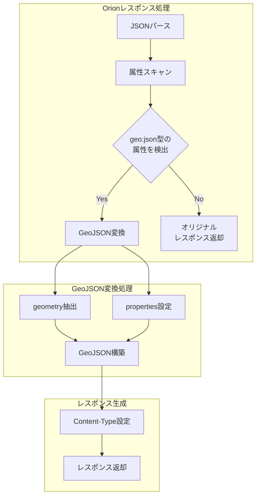

# Phase 2: プラグイン基本実装計画

## 概要
FIWARE Orion Context Brokerからのレスポンスを受け取り、GeoJSON形式に変換する基本機能の実装を行います。

## 実装アプローチ



## 実装詳細

### 1. スキーマ定義
```lua
-- schema.lua
return {
  name = "plugin-orionGeoJSON",
  fields = {
    { consumer = typedefs.no_consumer },
    { protocols = typedefs.protocols_http },
    { config = {
        type = "record",
        fields = {
          { output_format = {
              type = "string",
              required = true,
              default = "FeatureCollection",
              one_of = { "FeatureCollection", "Feature" }
            }
          }
        }
      }
    }
  }
}
```

### 2. 変換ロジック
```lua
-- handler.lua
function Plugin:body_filter(conf)
    -- 1. レスポンスのパース
    local body = kong.response.get_body()
    local data = cjson.decode(body)
    
    -- 2. geo:json型の属性を検索
    local geometries = {}
    local properties = {}
    
    for attr_name, attr in pairs(data) do
        if attr.type == "geo:json" then
            geometries[attr_name] = attr.value
        else
            properties[attr_name] = attr.value
        end
    end
    
    -- 3. GeoJSON形式に変換
    if next(geometries) then
        local geojson = {
            type = conf.output_format,
            geometry = next(geometries),
            properties = properties
        }
        return geojson
    end
    
    -- geo:json型の属性がない場合は元のレスポンスを返す
    return data
end
```

### 3. テスト実装
```lua
describe("orion2GeoJSON", function()
    -- 基本変換テスト
    it("converts geo:json attributes to GeoJSON", function()
        local input = {
            any_location = {
                value = {
                    type = "Point",
                    coordinates = [0, 0]
                },
                type = "geo:json"
            },
            temperature = {
                value = 25,
                type = "Number"
            }
        }
        
        local result = handler:body_filter(input)
        assert.are.equal("Feature", result.type)
        assert.are.equal("Point", result.geometry.type)
        assert.are.equal(25, result.properties.temperature)
    end)
    
    -- geo:json属性なしのケース
    it("returns original response when no geo:json attributes found", function()
        local input = {
            temperature = {
                value = 25,
                type = "Number"
            }
        }
        
        local result = handler:body_filter(input)
        assert.are.same(input, result)
    end)
end)
```

## 実装の特徴

1. シンプルな設計
   - 設定項目を最小限に抑制
   - 変換ロジックを明確に定義

2. 柔軟性の向上
   - エンティティタイプに依存しない
   - あらゆるgeo:json型属性に対応

3. エラーハンドリングの簡素化
   - geo:json属性がない場合は元のレスポンスを返す
   - 明確なフォールバック動作

## 実装スケジュール

| タスク | 期間 | 詳細 |
|--------|------|------|
| スキーマ実装 | 1日 | スキーマ定義とバリデーション実装 |
| 変換ロジック実装 | 2日 | GeoJSON変換処理の実装 |
| テスト実装 | 2日 | ユニットテストと統合テストの実装 |

合計期間: 5営業日